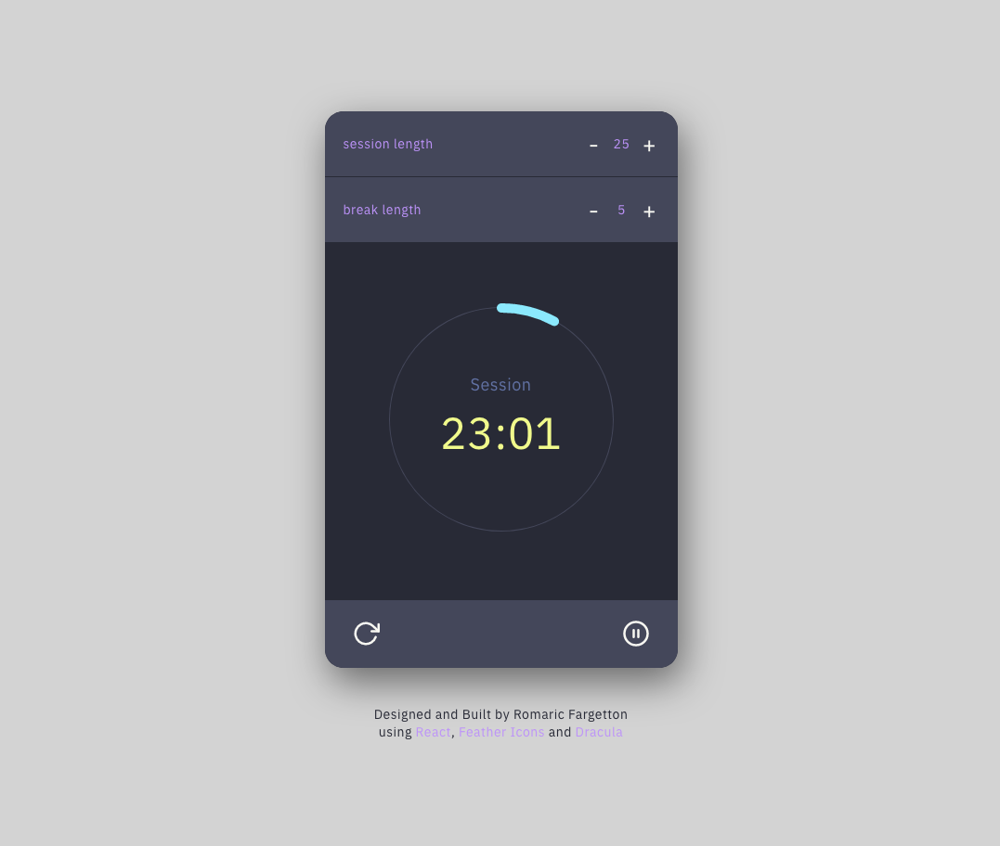

# Pomodoro Clock

A pomodoro timer built with React, featuring the [Dracula color Scheme](https://github.com/dracula/dracula-theme) and bootstraped with [Create React App](https://github.com/facebook/create-react-app). 
See a live demo [here](https://pomodoro.romaricfargetton.com).

[](https://app.netlify.com/sites/affectionate-volhard-57014b/deploys)



## Features

- **Controls** : start, pause and reset.
- **Visual feedback** : displays remaining time and progress wheel.
- **Audio signal** : triggers an audio signal at the end of every cycle.

## Installation

1. Clone this repo
    ```
    git clone https://www.github.com/rfargetton/pomodoro-clock
    ``` 
2. Install npm packages
    ```
    cd react-drum-machine && npm install
    ```
3. Run a development server
    ```
    npm start
    ```
4. Create a production build
    ```
    npm run build
    ```
